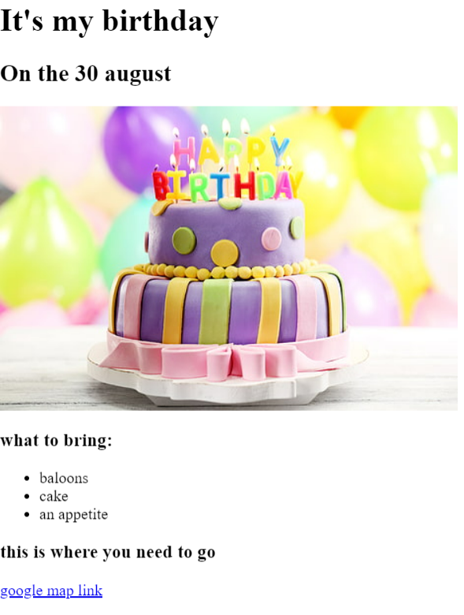

<!DOCTYPE html>
<html lang="en">
<head>
    <meta charset="UTF-8">
    <meta name="viewport" content="width=device-width, initial-scale=1.0">
    <title>my project website</title>
</head>
<body>
    <h1>Shuayb Khans portfolio</h1>
    <h2>i'm a web developer</h2>
    <h3><a href="./public/section 2 movie review project.html">Movie Ranking Project</a></body></h3>
    

    <h3><a href="./public/project birthday invite.html">My birthday invite project</a></h3>
    

<a href="./public/about.html">About me </a>   <a href="./public/contact.html">how to contact me if you want</a>
</body>
</html>
